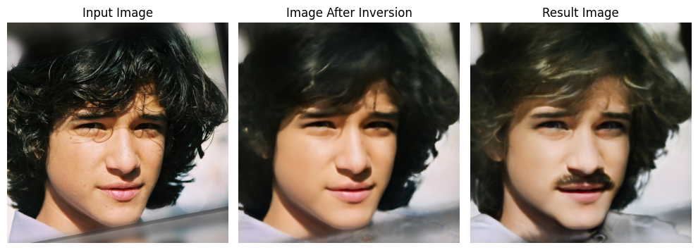

# CLIPInverter + PTI

This repository integrates [CLIPInverter](https://github.com/johnberg1/CLIPInverter) and [Pivotal Tuning Inversion (PTI)](https://github.com/danielroich/PTI) into a unified framework for **text-driven real image editing with identity preservation**.

* **CLIPInverter** manipulates StyleGAN latent codes guided by natural language descriptions.
* **PTI**, applied **only during inference**, fine-tunes the generator for each image to preserve the subject’s identity while maintaining semantic editability.

This combination enables high-quality, text-guided edits (e.g., hair color, expression, pose) while ensuring high fidelity to the input image.


## Features

* Inversion of real images into StyleGAN latent space using **e4e**.
* Text-driven semantic editing via **CLIP** guidance.
* **PTI-enhanced inversion** at inference for superior identity preservation.
* Supports **CelebA-HQ**, **FFHQ**, and other StyleGAN domains.


## Installation

```bash
git clone https://github.com/ossmjm/CLIPInverter-PTI.git
cd CLIPInverter-PTI

conda create -n clippti python=3.8 -y
conda activate clippti

pip install torch==1.7.1 torchvision==0.8.2 --extra-index-url https://download.pytorch.org/whl/cu110
pip install ftfy regex tqdm
pip install git+https://github.com/openai/CLIP.git
pip install -r requirements.txt
```


## Pretrained Models

Download the following pretrained models and place them in the `pretrained_models/` directory:

| Model                                                                                                     | Description                                                    |
| --------------------------------------------------------------------------------------------------------- | -------------------------------------------------------------- |
| [CLIPInverter Faces](https://drive.google.com/file/d/18goTnPtVrz1Tuen3JuDIEwj5z3GvgVqJ/view?usp=sharing)  | CLIPInverter trained on CelebA-HQ, includes StyleGAN2 weights. |
| [Dlib Alignment](https://drive.google.com/file/d/1uoOsJcT0bC-_zNDbhcj6iaxLJBN-LFao/view?usp=sharing)      | Dlib model for face alignment preprocessing.                   |
| [FFHQ e4e Encoder](https://drive.google.com/file/d/1kxYtrg4YQCudxL5f9xmCzOdJRITH5UXB/view?usp=share_link) | Pretrained e4e encoder.                                        |
| [StyleGAN2 FFHQ](https://drive.google.com/file/d/1EM87UquaoQmk17Q8d5kYIAHqu0dkYqdT/view)                  | StyleGAN2 pretrained on FFHQ 1024×1024.                        |

You can modify paths in `configs/path_configs.py`.


## Training

Training is divided into two stages:

* **Stage 1:** Train the CLIP adapter to align language and visual representations.
* **Stage 2:** Fine-tune the CLIP remapper for refined, controllable text-guided edits.

Before training, set dataset paths in:

* `configs/path_configs.py`
* `configs/data_configs.py`

### Stage 1 — CLIP Adapter

```bash
python scripts/train_first_stage.py \
--dataset_type celeba_encode \
--exp_dir=experiments/stage_one \
--stylegan_weights=pretrained_models/stylegan2_ffhq.pt \
--max_steps=200000
```

### Stage 2 — CLIP Remapper

```bash
python scripts/train_second_stage.py \
--dataset_type celeba_encode \
--exp_dir=experiments/stage_two \
--stylegan_weights=pretrained_models/stylegan2_ffhq.pt \
--checkpoint_path=experiments/stage_one/checkpoint.pt \
--is_training_from_stage_one
```


## Inference with PTI

During inference, PTI can be used to improve identity preservation by fine-tuning the generator for the specific input image.
Using the `--use_pti` flag enables this process.
Without it, inference behaves like standard CLIPInverter (faster but less faithful to identity).

```bash
python infer.py \
--input_image_path aligned_images/sample.jpg \
--caption "make the person have blonde hair" \
--model_path pretrained_models/pretrained_faces.pt \
--e4e_path pretrained_models/e4e_ffhq_encode.pt \
--use_pti
```

Results are automatically saved in the `results/` directory.


## Example

**Caption:** “He has a moustache with blonde hair and blue eyes.”




## References

* [CLIPInverter (Baykal et al., ACM TOG 2023)](https://github.com/johnberg1/CLIPInverter)
* [PTI (Roich et al., ICCV 2021)](https://github.com/danielroich/PTI)


## Citation

If you use this repository in your research, please cite the original works:

```bibtex
@article{baykal2023clipinverter,
  title={CLIPInverter: Image Editing via Text-Guided Latent Optimization},
  author={Baykal, G{\"o}khan and others},
  journal={ACM Transactions on Graphics (TOG)},
  year={2023}
}

@inproceedings{roich2021pivotal,
  title={Pivotal Tuning for Latent-based Editing of Real Images},
  author={Roich, Daniel and others},
  booktitle={Proceedings of the IEEE/CVF International Conference on Computer Vision (ICCV)},
  year={2021}
}
```

---

## License

This repository builds upon CLIPInverter and PTI, both released under the MIT License.

* CLIPInverter © 2023 Baykal et al.
* PTI © 2021 Roich et al.

Their original code and pretrained models are redistributed here with proper attribution.
Please consult their repositories for full license details.
