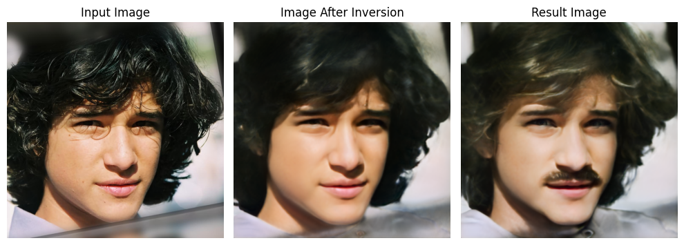

# CLIPInverter + PTI

This repository combines [CLIPInverter](https://github.com/williamyang1991/CLIPInverter) and [Pivotal Tuning Inversion (PTI)](https://github.com/danielroich/PTI) into a unified framework for text-driven real image editing with identity preservation.

* **CLIPInverter** learns to manipulate StyleGAN latent codes using natural language descriptions.
* **PTI** is applied **only during inference**. It fine-tunes the generator on a given input image, leading to reconstructions that preserve the subject’s identity while still allowing semantic editing.

This integration provides high-quality, text-guided edits (hair color, expression, pose, etc.) while maintaining fidelity to the input image.

## Features

* Inversion of real images into StyleGAN latent space using e4e.
* Text-driven semantic editing via CLIP guidance.
* PTI-enhanced inversion at inference for high-fidelity identity preservation.
* Support for CelebA-HQ, FFHQ, and other StyleGAN domains.

## Prerequisites

```bash
git clone https://github.com/your-username/CLIPInverter-PTI.git
cd CLIPInverter-PTI

conda create -n clippti python=3.8 -y
conda activate clippti

conda install --yes -c pytorch pytorch=1.7.1 torchvision cudatoolkit=11.0
pip install ftfy regex tqdm lpips
pip install git+https://github.com/openai/CLIP.git
```

### Pretrained Models

The following pretrained models from CLIPInverter should be downloaded and placed in `pretrained_models/`:

| Model                                                                                                     | Description                                                       |
| --------------------------------------------------------------------------------------------------------- | ------------------------------------------------------------------|
| [CLIPInverter Faces](https://drive.google.com/file/d/18goTnPtVrz1Tuen3JuDIEwj5z3GvgVqJ/view?usp=sharing)  | CLIPInverter trained on CelebA-HQ, including StyleGAN2 weights.   |
| [Dlib Alignment](https://drive.google.com/file/d/1uoOsJcT0bC-_zNDbhcj6iaxLJBN-LFao/view?usp=sharing)      | Dlib model for preprocessing.                                     |
| [FFHQ e4e Encoder](https://drive.google.com/file/d/1kxYtrg4YQCudxL5f9xmCzOdJRITH5UXB/view?usp=share_link) | Pretrained e4e encoder.                                           |
| [StyleGAN2 FFHQ](https://drive.google.com/file/d/1EM87UquaoQmk17Q8d5kYIAHqu0dkYqdT/view)                  | StyleGAN2 pretrained on FFHQ 1024×1024.                           |
| [IR-ResNet-50](https://drive.google.com/file/d/1LOhiFzHe0FGXr14u6W8N_y4FFQDk0en1/view?usp=drive_link)     | identity encoder to preserve identity consistency during editing. |                       

Paths can be customized in `adapter/configs/path_configs.py`.


## Training

Training follows the same procedure as CLIPInverter:

* Configure dataset paths in `adapter/configs/path_configs.py` and `adapter/configs/data_configs.py`.
* Train in two stages: first the CLIP adapter, then the CLIP remapper.
* Refer to the CLIPInverter documentation for full argument details.

Example first stage:

```bash
python scripts/train_first_stage.py \
--dataset_type celeba_encode \
--exp_dir=experiments/stage_one \
--stylegan_weights=pretrained_models/stylegan2_ffhq.pt \
--max_steps=200000
```

Example second stage:

```bash
python scripts/train_second_stage.py \
--dataset_type celeba_encode \
--exp_dir=experiments/stage_two \
--stylegan_weights=pretrained_models/stylegan2_ffhq.pt \
--checkpoint_path=experiments/stage_one/checkpoint.pt \
--is_training_from_stage_one
```

## Inference with PTI

The inference process differs from CLIPInverter by incorporating PTI for identity preservation.

```bash
python infer.py \
--input_image_path=/path/to/input/image \
--caption="target description" \
--model_path=/path/to/clipinverter/model \
--e4e_path=/path/to/pretrained/e4e/ \
--use_pti
```

#### Example Usage

```bash
!python infer.py \
--input_image_path=assets/favourite.jpg \
--caption="Add a well-blended, natural-looking beard that matches the face’s hair texture and lighting, while preserving all other facial details such as the smile, expression, and skin tone." \
--model_path=pretrained_models/pretrained_faces.pt \
--e4e_path=pretrained_models/e4e_ffhq_encode.pt \
--use_pti
```

Results are saved in `results/`.


## Example


**Caption**: "He has a moustache with blond hair and blue eyes"



## References

* [CLIPInverter (Baykal et al., ACM TOG 2023)](https://github.com/johnberg1/CLIPInverter)
* [PTI (Roich et al., ICCV 2021)](https://github.com/danielroich/PTI)
  

## License

This repository builds upon CLIPInverter and PTI, both released under the MIT License.

* CLIPInverter © 2023 Baykal et al.
* PTI © 2021 Roich et al.

Their original code and pretrained models are redistributed here with attribution. Please consult their repositories for license details.

---
